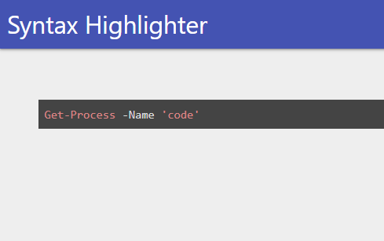

# ud-syntaxhighliter

Syntax Highlighter for Universal Dashboard

# Installation 

```
Install-Module UniversalDashboard.SyntaxHighlighter 
```

# Example

```
Import-Module UniversalDashboard
Import-Module UniversalDashboard.SyntaxHighlighter

$Dashboard = New-UDDashboard -Title "Syntax Highlighter" -Content {
    New-UDSyntaxHighlighter -Language PowerShell -Style dark -Code "Get-Process -Name 'code'"
}

Start-UDDashboard -Dashboard $Dashboard -Port 10001 -Force
```


# Support Languages

- [Supported Languages](https://github.com/conorhastings/react-syntax-highlighter/blob/master/AVAILABLE_LANGUAGES_HLJS.MD)